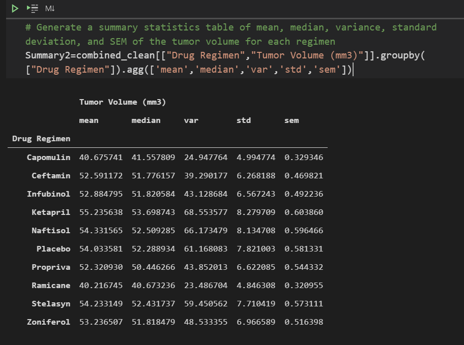

# Matplotlib Challenge - Plotting Pharmaceutical Data

## Summary

In this project, I am running statistical tests to look for correlation between data sets and creating plots to help visualize the findings.

## Tools
These are the tools, techniques, and resources used in this project.

* Jupyter Notebook / Python using the matplotlib, pandas, scipy, and numpy libraries

### About the Data

This is fictional data, created for this challenge. The data is meant to represent pharmaceutical testing.

## Project Steps

### Step 1: Cleaning the Data
Two data sets are provided with this challenge, one showing the metadata for each mouse and the other showing the study results. It would be absurd to assume that all of the researchers are entering perfect data each time so I check for duplicate entries:

It looks like Mouse g989 may have duplicate entries, so I take a look at a DF with only that data:

It wouldn't be possible to know which data is correct for this mouse, so I drop the results for it.

### Step 2: Summary Statistics

Next up, I looked at summary statistics for each of the drugs used in the study, Pandas makes this easy with the .agg functionality.

### Step 3: Box Plots

I was asked to create box plots for the 4 most promising treatments and display them together. Below is a snippet of the code used for this:

### Step 4: Line Graph

I was asked to display the tumor volume for one of the mice over time. This can easily be manipulated to show the results for any given mouse.

### Step 5: Tool Tips

The final ask in this challenge was to put together a scatter plot that shows the relationship between the weight of a mouse and the average volume of the final tumor. Looking at the visual below, I can say with certainty that these two things are highly correlated in this study.

